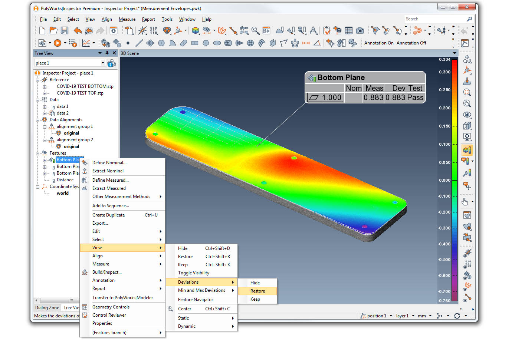
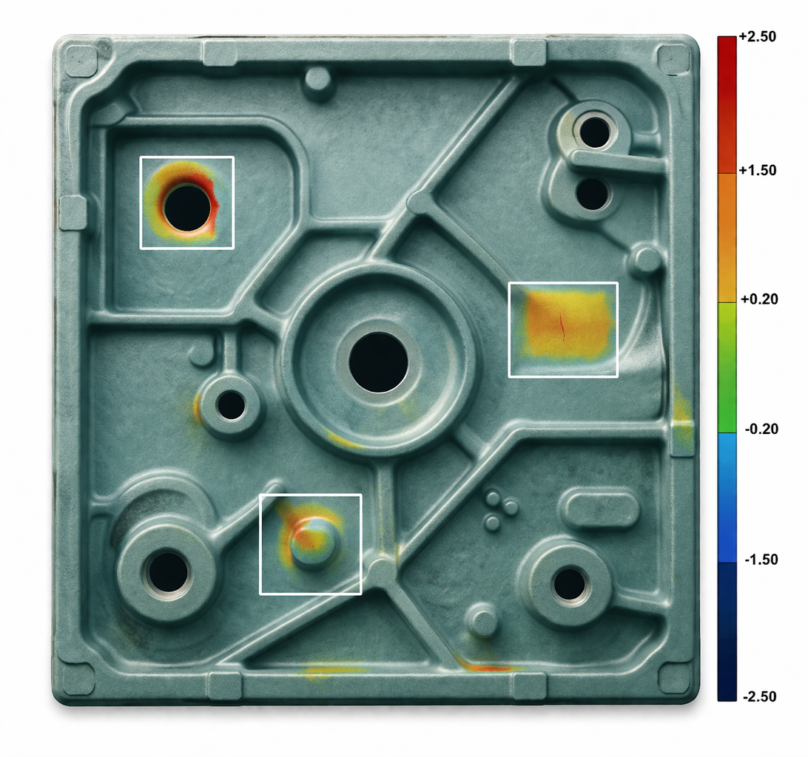

# DL Dimensional Metrology

Deep Learning pipeline for automated visual inspection of digitized industrial components, combining a custom Convolutional Neural Network (CNN) for binary conformance classification and a YOLOv8 architecture for precise spatial defect localization.

The dataset consists of color-deviation maps — images generated by overlaying digitized 3D point-clouds onto their CAD reference models — produced by industrial-grade scanners (HandScan, MetraSCAN). Each image encodes geometric deviation as a thermal color scale: warm colors indicate excess material, cold colors indicate material absence.

> 🔒 **Industrial Confidentiality Strategy:** This repository publishes the complete engineering architecture, programmatic methodology, YOLO pipelines, and OpenCV tooling. However, the proprietary color-deviation maps and trained `.pt`/`h5` weights are permanently omitted from this repository due to Non-Disclosure Agreements (NDA) and IP constraints. This repo serves as a transparent portfolio of Applied AI Methodology. We provide a **synthetic dummy data generator** allowing visitors to execute the pipeline natively without needing the corporate dataset.

---

## What you can run without the private dataset

To demonstrate the robustness of out-of-the-box scripts, we created a lightweight Python generator. You can generate synthetic thermal "deviation maps" mimicking real industrial topologies and test our OpenCV sorters and YOLO splitters instantly.

1. Install dependencies: `pip install -r requirements-yolo.txt`
2. Run the synthetic generator:
   ```bash
   python scripts/generate_dummy_data.py
   ```
   *(This populates `data/raw/` with 10 synthetic grids — 5 conforming and 5 containing an artificial 'defect' hotspot).*
3. Test the interactive sorter on the synthetic data:
   ```bash
   python scripts/classify_images.py
   ```
   *(Allows you to sort the 10 fake images into `good` or `bad` folders via keyboard shortcuts).*

---

## Background

Industrial dimensional metrology has evolved significantly with the adoption of 3D digitization systems. Modern scanners capture complex geometries rapidly and non-destructively, generating high-resolution point-cloud representations of manufactured parts. However, interpreting the resulting deviation maps — comparing scanned geometry against CAD references — still depends heavily on human analysts, who visually evaluate thousands of inspections per production cycle.

This reliance on manual interpretation introduces a well-documented bottleneck: human fatigue, varying experience levels, and subjective judgment create inconsistency at scale. The problem compounds when dimensional tolerances are tight and production volumes are high.

This project was developed alongside academic research on the application of deep learning to dimensional metrology. The core idea: train convolutional models directly on the color deviation maps that metrologists already produce, automating both the binary conformance decision and the spatial localization of non-conforming regions.

---

## Dataset Generation Process

The images used to construct the models originate from a standardized metrology workflow:

1. **3D Digitization** — Parts are scanned using optical devices (HandScan or MetraSCAN), producing `.stl` or point-cloud files.
2. **CAD Alignment** — The scanned geometry is aligned to the nominal CAD model using reference datum points (geometric zeros defined in the engineering drawing), following ASME Y14.5 or applicable ISO norms.
3. **Color Deviation Map** — The software overlays the scan onto the CAD and renders a color map encoding surface deviation. Dimensional tolerances (often derived from ISO 8062-3 or customer-specific tables) define the acceptance band.
4. **Labeling** — Images are classified as *conforming* or *non-conforming* based on the applied tolerance thresholds. For YOLO training, the specific defective regions are annotated manually using bounding boxes.

The 3D file, 2D drawings, and technical standards defining the manufacturing and acceptance criteria of the product are usually provided by the customer. These documents establish the dimensional and geometric conformity conditions of the part, which is fundamental for the dimensional analysis process. In addition, the reference points, known as datum points (or zero points), are provided, defining the regions of the part from which the evaluation of other regions must start. This alignment is a critical step, as it ensures that the subsequent color map comparison is performed correctly, guaranteeing that the evaluated dimensions are effectively related to the references established in the technical drawing.

To exemplify the alignment process, Figure 1 presents a technical drawing with dimensional and geometric tolerances applied according to the ASME Y14.5-2009 standard. In this case, the planes and surfaces identified as A, B, and C are the designated references (datum points) for positioning the part, ensuring the dimensional analysis will be conducted accurately. 

*Figure 1 – Alignment example using geometric references*
*(Source: Adapted from Baker, 2021)*

Based on this set of information, standards, and product alignment, the comparison stage is performed using the color map. This aims to visually assist in evaluating whether the surfaces and dimensions of the digitized part conform to the 3D CAD model. This resource visually associates geometric differences with a color scale, where regions with excess material (i.e., areas where measurements are above the CAD model) are displayed in warm colors. Conversely, regions with a lack of material or dimensions below the CAD model are displayed in cold colors. This visual representation allows for quick identification of both localized deviations and overall trends across the product, facilitating decision-making regarding the acceptance or rejection of the analyzed part. Figure 2 presents an example of a comparison between a digitized part and its respective CAD file, applying the color map over the surfaces and highlighting the regions with excess or missing material.

*Figure 2 – Color map comparison*



*(Source: HAVEN METROLOGY, 2020)*

### Simulation and Augmentation

To expand the dataset volume beyond what single-part production batches provide, geometric variation was simulated: small rotations and translations were applied to existing scan alignments from their datum reference points, reproducing realistic manufacturing variability. This approach generated multiple dimensional variants of the same component, significantly increasing training sample diversity.

| Configuration | Samples | CNN Accuracy |
|---|---|---|
| Initial validation set | 46 | 1.00 (memorized — not generalizable) |
| Intermediate set | 215 | 0.89 |
| Full training set | 827 | **0.97** |

---

## Project Structure

```text
DL_Dimensional_Metrology/
│
├── README.md                           # Readme Page
├── .gitignore                          # Blocks proprietary data and models
├── requirements-cnn.txt                # Specific TensorFlow/Keras libs
├── requirements-yolo.txt               # Specific Ultralytics/PyTorch libs
│
├── data/                               # Generated locally
│   ├── raw/                            # Unsorted images (real or dummy)
│   ├── good/                           # Conforming samples
│   ├── bad/                            # Non-conforming samples
│   ├── dataset_yolo/                   # Final 70/20/10 structure for YOLO
│
├── notebooks/
│   ├── 01_CNN_Binary_Classification.ipynb    # Full CNN training pipeline
│   └── 02_YOLO_Defect_Localization.ipynb     # YOLOv8 fine-tuning and evaluation
│
├── scripts/
│   ├── generate_dummy_data.py  # Synthetic generator for pipeline testing
│   ├── classify_images.py      # Interactive OpenCV tool for manual image sorting
│   ├── yolo_annotation.py      # Bounding-box annotation engine
│   ├── yolo_dataset_split.py   # Stratified dataset organizer for YOLO
│   └── data.yaml               # YOLO class paths and attributes
│
└── docs/
    ├── polyworks_example.png   # PolyWorks color map comparison example
    └── yolo_defect_example.png # Example of semantic deviation map
```

---

## Pipeline

```text
3D Scanner Output (.stl / point cloud)
    │
    ▼  CAD Alignment (datum reference points)
Color Deviation Map (thermal-scale image)
    │
    ▼  scripts/classify_images.py  (interactive manual sorting)
data/good/  +  data/bad/
    │
    ├──▶  [CNN PATH]
    │         ▼  notebooks/01_CNN_Binary_Classification.ipynb
    │     Binary classifier  →  "Conforming" / "Non-conforming"
    │     Result: 97% accuracy on 827-sample dataset
    │
    └──▶  [YOLO PATH]
              ▼  scripts/yolo_annotation.py  (bounding box labeling)
          data/labels_bad/
              ▼  scripts/yolo_dataset_split.py  (stratified split)
          data/dataset_yolo/
              ▼  notebooks/02_YOLO_Defect_Localization.ipynb
          Spatial defect localization  →  Bounding boxes over defective regions
          Result: 71.7% IoU, 98% classification accuracy
```

---

## Results Summary

### Visual Data & Metrics



### CNN Binary Classifier

Trained on 827 color deviation map images across two classes (conforming / non-conforming):

- **Accuracy**: 97%
- **Precision**: 97%
- **Recall**: 97%

The model was evaluated on an independent held-out test set (30% of the dataset). The strong performance confirms that convolutional filters successfully capture the visual signature of dimensional non-conformance. Data augmentation (rotations, zoom, shear) produced no measurable accuracy improvement — likely because the color gradient patterns encoding conformance are hyper-sensitive to geometric physical distortion.

### YOLOv8 Spatial Locator

Fine-tuned from YOLOv8n (nano) COCO pre-trained weights over 150 epochs on the annotated defective regions:

| Metric | Value |
|---|---|
| Precision | 69.7% |
| Recall | 45.5% |
| IoU (> 0.3 threshold) | 71.7% |
| Classification Accuracy | 98% |

→ **Strong spatial awareness, constrained recall due to dataset size**

The 98% classification accuracy confirms the model reliably distinguishes images containing defects from clean ones. The 45.5% recall reflects the inherent difficulty of localizing small, ambiguous boundary regions in manually annotated industrial data, where inter-annotator variability affects the ground-truth labels themselves.

---

## Key Design Choices (and Why)

**Why color deviation maps and not raw point clouds?**
Point-cloud data requires specialized volumetric preprocessing pipelines. Deviation maps are already the standard output of industrial metrology software (e.g. PolyWorks, GOM Inspect), making this approach directly compatible with existing production workflows. No additional 3D preprocessing is needed.

**Why 3 convolutional blocks with 32→64→128 filters?**
The progressive depth increase matches the hierarchical nature of the task. Early filters capture edges and color gradients. Deep filters encode the conformance/deviation patterns that distinguish classes. MaxPooling 2×2 after each block reduces spatial dimensionality while preserving dominant activations.

**Why Dropout(0.5) after the Dense layer?**
With fewer than 1,000 samples, the network is at risk of memorizing examples. Dropout forces the model to learn redundant, distributed representations — increasing generalization visually.

**Why YOLOv8n (nano) and not a larger variant?**
The dataset contains a compact set of labeled defective regions — insufficient to justify the parameter count of YOLOv8m or YOLOv8l. The nano variant trains in reasonable time, avoids severe overfitting, and limits hardware dependence while benefiting fully from COCO transfer learning.

---

## Limitations and Future Steps
- **Annotation Subjectivity**: Bounding box labels were drawn manually. Regions of gradual deviation (near tolerance boundaries) introduce inter-annotator variability that directly limits YOLO recall.
- **Single defect class**: Detecting excess material versus missing material currently relies on singular classification. Sub-classification requires larger annotated bases.
- **Future Integration**: Grad-CAM visualization mappings for CNN layer interpretations are planned to provide deeper diagnostic explainability in regulated engineering lines.

---

## Academic References

- **HAVEN METROLOGY.** (2020). Understanding GD&T Flatness in PolyWorks 2020. Haven Metrology. Available at: https://www.havenmetrology.com/understanding-gdt-flatness-in-polyworks-2020/.
- **Baker,** (2021). *Geometric Dimensioning and Tolerancing Reference*.
- **Wagner, P. et al.** (2020). PTB-XL, a large publicly available electrocardiography dataset. *Scientific Data*.
- **Redmon, J. et al.** (2016). You Only Look Once: Unified, Real-Time Object Detection. *CVPR*.
- **Kang, S. et al.** (2024). Object Detection YOLO Algorithms and Their Industrial Applications. *Electronics*.
- **Yamashita, R. et al.** (2018). Convolutional neural networks: an overview. *Insights into Imaging*.
- **ISO 8062-3:2007** — Dimensional/geometrical tolerances for castings. Geneva: ISO.
